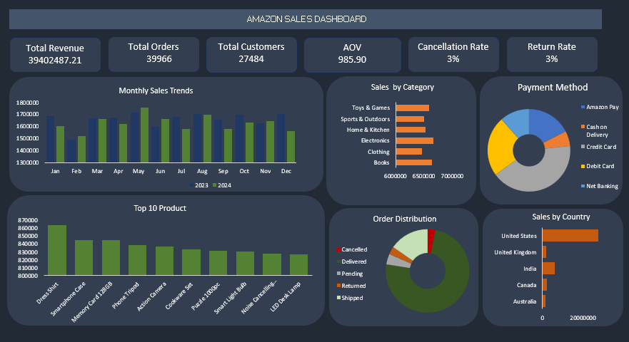

# Amazon Sales Dashboard - Excel

## Project Overview
An interactive Amazon Sales Dashboard developed using Microsoft Excel to analyze sales performance and generate business insights.

## Tools Used
- Microsoft Excel
- Data Cleaning
- Data Analysis
- Data Visualization
- Excel Charts and KPIs

## Key KPIs
- Total Revenue
- Total Orders
- Total Customers
- Average Order Value (AOV)
- Cancellation Rate
- Return Rate

## Analysis
The dashboard provides insights into:
- Monthly sales trends
- Sales by category
- Top 10 products
- Payment methods
- Order distribution
- Country-wise sales performance

## Dashboard Preview

## Project File
The complete Excel dashboard is available in `Amazon Sales Dashboard.xlsx`.
